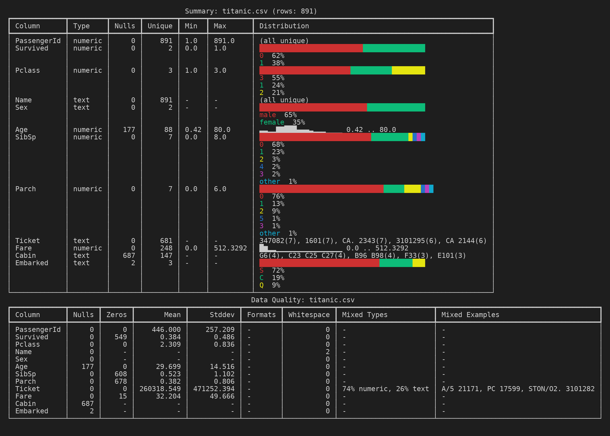

# cplt

[](https://pypi.org/project/cplt/)
[](LICENSE)
[](https://github.com/Warhorze/cplt/actions/workflows/ci.yml)

Plot CSV files directly in your terminal.
Zero GUI. Zero notebooks. Just your CLI.

## Why cplt

Most terminal plotting tools handle bars and lines, but not timeline ranges from CSV start/end columns. `cplt` focuses on that workflow while still covering the common chart types:

- `timeline` for Gantt-style range plots
- `bar` for value-count distribution
- `line` for numeric trends over time or sequence
- `hist` for numeric column histograms
- `bubble` for presence/absence matrices
- `summarise` for fast column profiling

## Get Started In 30 Seconds

```bash
pip install cplt
cplt timeline -f data/projects.csv --x planned_start --x planned_end --y project
```

## Install

```bash
pip install cplt
# or
pipx install cplt
```

Standalone binaries are available from the [latest GitHub release](https://github.com/Warhorze/cplt/releases/latest).

Enable shell completion after install:

```bash
cplt --install-completion
```

## What It Looks Like

### Tab Completion

Deep completion for `--where` filters: discover available columns, then see matching values.


### Summarise

Quick column profiling — types, nulls, uniques, and smart distribution views at a glance. Low-cardinality columns get percentage breakdowns, numerics get sparkline histograms, and ID columns are detected automatically.

```bash
cplt summarise -f data/titanic.csv
```



### Timeline / Gantt

Visualise project schedules as Gantt-style ranges with color-coded status and a "today" marker.

```bash
cplt timeline -f data/projects.csv --x start_date --x end_date --y project --color status
```


### Bar Chart

Count values in a column, filter with `--where`, and label the bars.

```bash
cplt bar -f data/titanic.csv -c Embarked
```


### Line Chart

Plot numeric trends over time with `--head` to limit rows and `--title` for context.

```bash
cplt line -f data/temperatures.csv --x Date --y Temp --head 40
```


### Histogram

Plot the distribution of a numeric column with automatic binning and statistics overlay.

```bash
cplt hist -f data/titanic.csv -c Age --bins 10
```

### Bubble Matrix

Spot missing data patterns across columns. Rows are labeled, columns are presence/absence dots, colored by group.

```bash
cplt bubble -f data/titanic.csv --cols Cabin --cols Age --y Name --head 12
```


## Quick Start

```bash
# 1) inspect columns and data quality
cplt summarise -f data/projects.csv

# 2) make your first timeline
cplt timeline -f data/projects.csv --x planned_start --x planned_end --y project

# 3) filter rows
cplt bar -f data/titanic.csv -c Embarked --where "Sex=female"
```

## Output Modes

All plotting and summary commands support `--format`:

- `visual` (default): full Rich/plotext terminal visuals
- `semantic`: ANSI-stripped visual output (useful for LLM UX inspection)
- `compact`: token-efficient output for LLM analysis pipelines

Example:

```bash
cplt bar -f data/titanic.csv -c Sex --format compact
```

## Docs

- CLI reference: `docs/cli.md`
- Project docs: `docs/`

## For Contributors

Developer-only workflows (UX review loop, artifact generation, docs tooling, tests) live in `DEVELOPERS.md`.

## License

[MIT](LICENSE)
