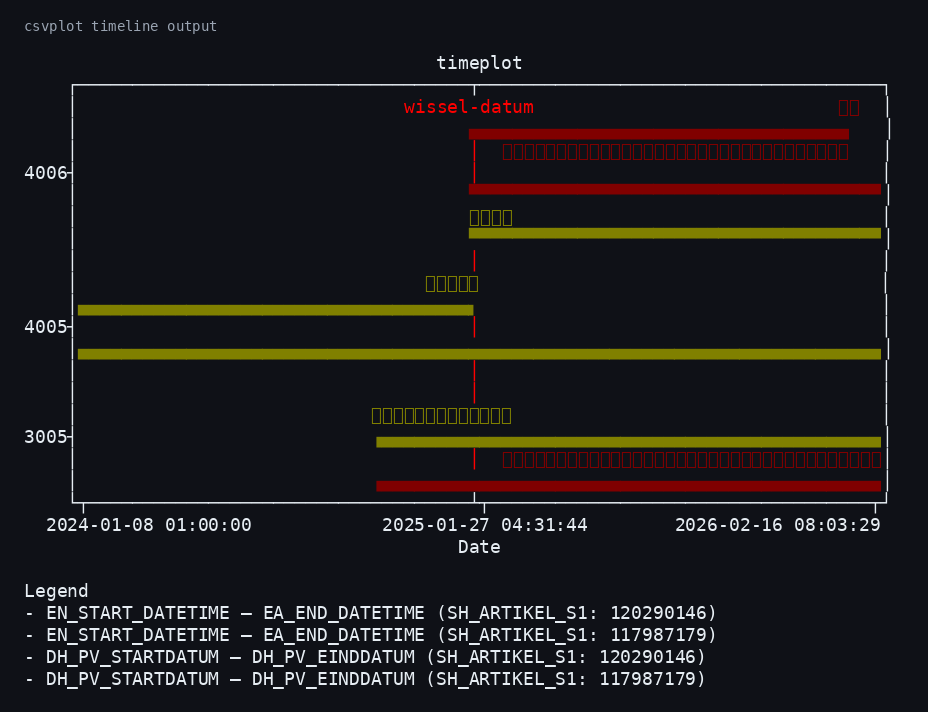
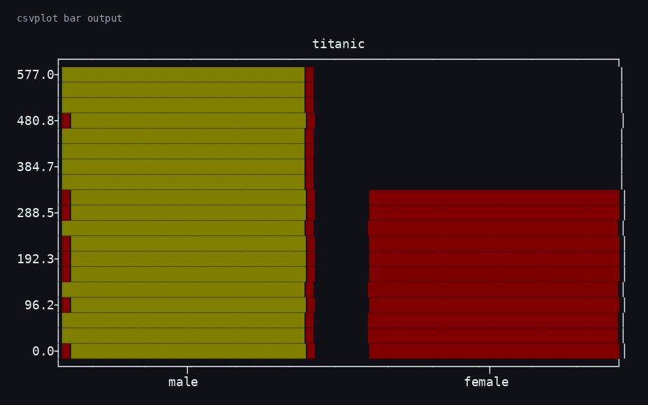
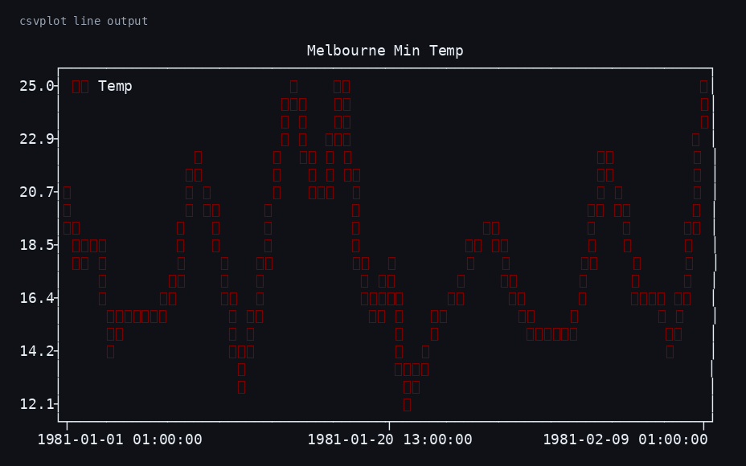
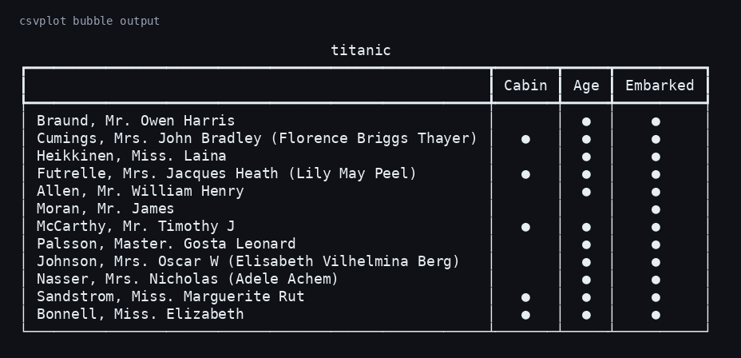

# csvplot

[](https://pypi.org/project/csvplot/)
[](LICENSE)
[](https://github.com/Warhorze/csvplot/actions/workflows/ci.yml)

Plot CSVs directly in your terminal with first-class timeline/Gantt support.

## Get Started In 30 Seconds

```bash
pip install csvplot
csvplot timeline -f data/projects.csv --x planned_start --x planned_end --y project
```

## Why csvplot

Most terminal plotting tools handle bars and lines, but not timeline ranges from CSV start/end columns. `csvplot` focuses on that workflow while still covering the common chart types:

- `timeline` for Gantt-style range plots
- `bar` for value-count distribution
- `line` for numeric trends over time or sequence
- `bubble` for presence/absence matrices
- `summarise` for fast column profiling

## Install

```bash
pip install csvplot
# or
pipx install csvplot
```

Standalone binaries are available from the [latest GitHub release](https://github.com/Warhorze/csvplot/releases/latest).

Enable shell completion after install:

```bash
csvplot --install-completion
```

## What It Looks Like

### Timeline / Gantt

```bash
csvplot timeline -f data/timeplot.csv \
  --x DH_PV_STARTDATUM --x DH_PV_EINDDATUM \
  --x EN_START_DATETIME --x EA_END_DATETIME \
  --y DH_FACING_NUMMER --color SH_ARTIKEL_S1 \
  --marker 2025-01-22 --marker-label wissel-datum
```



### Bar Chart

```bash
csvplot bar -f data/titanic.csv --column Sex
```



### Line Chart

```bash
csvplot line -f data/temperatures.csv --x Date --y Temp --head 40 --title "Melbourne Min Temp"
```



### Bubble Matrix

```bash
csvplot bubble -f data/titanic.csv --cols Cabin --cols Age --cols Embarked --y Name --head 12
```



## Quick Start

```bash
# 1) inspect columns and data quality
csvplot summarise -f data/projects.csv

# 2) make your first timeline
csvplot timeline -f data/projects.csv --x planned_start --x planned_end --y project

# 3) filter rows
csvplot bar -f data/titanic.csv -c Embarked --where "Sex=female"
```

## UX Review Flow

Use this loop when reviewing chart quality and regressions:

1. Generate or update showcase images:

```bash
bash scripts/generate_readme_images.sh
```

2. Generate design review artifacts and report:

```bash
bash scripts/generate_design_review_images.sh
```

3. Review plot-specific criteria in:

- `docs/design/timeline.md`
- `docs/design/bar.md`
- `docs/design/line.md`
- `docs/design/bubble.md`

4. Check generated review report:

- `assets/review/REPORT.md`

5. For color behavior (for example bubble `--color`), use the generated PNGs plus the visual output checks in `assets/review/raw/`.

## Output Modes

All plotting and summary commands support `--format`:

- `visual` (default): full Rich/plotext terminal visuals
- `semantic`: ANSI-stripped visual output (useful for LLM UX inspection)
- `compact`: token-efficient output for LLM analysis pipelines

Example:

```bash
csvplot bar -f data/titanic.csv -c Sex --format compact
```

## Docs

- CLI reference: `docs/cli.md`
- MkDocs site source: `docs/` and `mkdocs.yml`
- Design review docs: `docs/design/`

Regenerate CLI docs:

```bash
bash scripts/generate_cli_docs.sh
```

Regenerate README images:

```bash
bash scripts/generate_readme_images.sh
```

Generate design review artifacts (plot-specific review images + report):

```bash
bash scripts/generate_design_review_images.sh
```

Preview docs locally:

```bash
uv sync --extra docs
uv run mkdocs serve
```

<details>
<summary>Regenerate README Figure Assets</summary>

Uses `scripts/generate_readme_images.sh`, which:

- runs the timeline/bar/line/bubble sample commands
- captures visual output (including ANSI colors)
- renders PNGs into `assets/images/`

```bash
bash scripts/generate_readme_images.sh
```
</details>

## Development

```bash
uv sync --extra dev
uv run pytest
uv run ruff check src/ tests/
uv run pyright
```

## License

[MIT](LICENSE)
